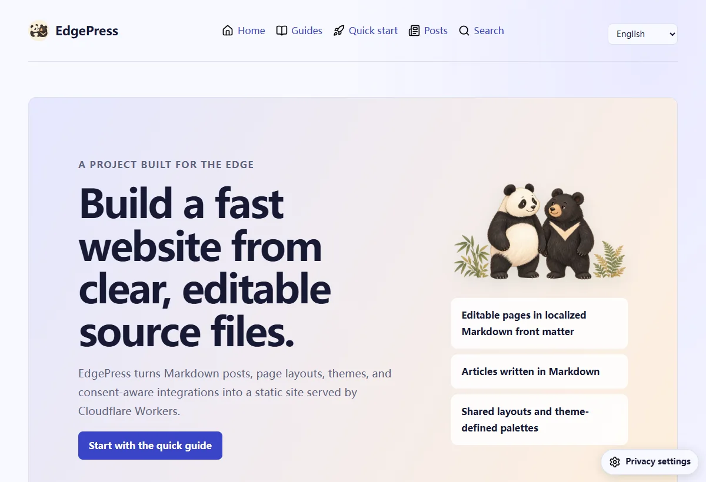
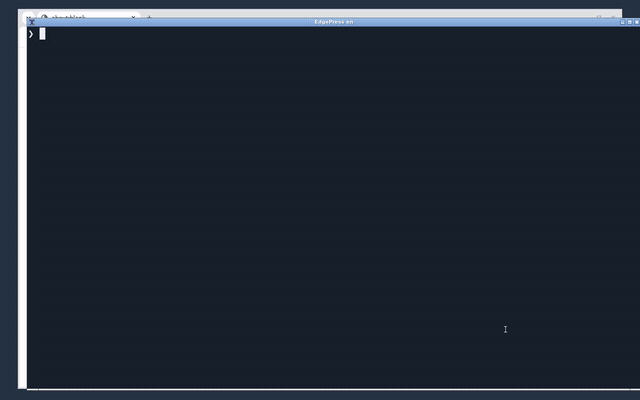

# EdgePress

A static-site builder for independent writing, small websites and curious experiments. Keep content in plain files and use the host you already have.

Curious about improving this project? Vibe Coding and AI-assisted contributions are welcome, with no tool restrictions. Start with [Contributing](CONTRIBUTING.md), follow [AGENTS.md](AGENTS.md), and share a small, understandable change with reproducible tests. [Report a bug or idea](https://github.com/jsw-teams/edgepress/issues/new/choose) · [Security](SECURITY.md) · [License](LICENSE).

EdgePress automatically registers page-specific native WebMCP tools for reading visible page content, navigating existing same-origin page links and using available document-preview controls. It uses `document.modelContext` only when supported; otherwise it silently does nothing. No Cloudflare bridge, polyfill, AI provider request or script injection into document frames is needed. Document tools invoke the existing UI without bypassing consent or enabling downloads. Disable Cloudflare’s `webmcp_enabled` injection to avoid duplicate bridges; this is independent of WAF or bot protection.

Document previews use the browser-only `document-viewer` package: PDF, DOC/DOCX, PPT/PPTX and XLS/XLSX render inside the page automatically without moving keyboard focus. Articles accept `!document[Report](/documents/report.docx)`; Pages support `type: document`. Remote direct-file URLs require a configured consent service and CORS. See the theme-development guide.

The dependency is pinned to a full commit in the public [document-viewer repository](https://github.com/jsw-teams/document-viewer). Cloud `npm ci` needs no sibling checkout, bundled source snapshot or Office conversion software. Publish and validate document-viewer first, then update the dependency URL and lockfile here. Sites can consume the resulting pinned EdgePress commit without copying either implementation.

[](https://deploy.workers.cloudflare.com/?url=https://github.com/jsw-teams/edgepress)
[](https://edgeone.ai/pages/new?repository-url=https%3A%2F%2Fgithub.com%2Fjsw-teams%2Fedgepress&build-command=npm%20run%20build&install-command=npm%20ci&output-directory=dist)
[](https://vercel.com/new/clone?repository-url=https%3A%2F%2Fgithub.com%2Fjsw-teams%2Fedgepress)
[](https://app.netlify.com/start/deploy?repository=https://github.com/jsw-teams/edgepress)
[](https://esa.console.aliyun.com/edge/pages/creation)

The Cloudflare button creates a copy of this repository in your GitHub account and a new Worker in your Cloudflare account. It is for creating a separate site, not updating an existing one. Choose unused destination repository and Worker names during setup. If `edgepress` already exists, choose a different name such as `my-edgepress-site`; to update an existing deployment, use that repository's connected Workers Builds integration instead of clicking the button again.

EdgePress builds static websites for Cloudflare, Vercel, Netlify, Tencent EdgeOne Pages and Alibaba Cloud ESA Pages.

Built-in themes include local Noto fonts for English and simplified/traditional Chinese. Unicode subsets load on demand, with no font CDN or requirement to install Chinese fonts. Custom themes can use the shared font variables described in the [theme guide](content/pages/theme-development/en.md).

Content images open a zoomable, closable viewer. The [media-viewer component](https://github.com/jsw-teams/media-viewer) is bundled locally; original images load on click when an original URL is provided.

The builder automatically explains the latest article edit. Readers see formatted **Previously / Now** passages, actual before-and-after local pictures, and clear additions or removals in responsive cards that inherit the theme palette. Changed pictures receive hashed snapshots from Git, so replacing or removing the original file does not break the comparison. Set `showChanges: false` to hide the panel for an article.


[中文说明：写文建站](content/guides/zh-cn.md) | [Free-tier comparison](content/guides/platforms.md)



Buttons open repository setup. Cloudflare, Vercel, Netlify and EdgeOne support repository templates; ESA opens its official import screen, where you authorize GitHub and select the repository. Every static platform uses `npm run build` and `dist/`; no database or website Function is required. Write posts in Markdown, compose pages from editable rows and elements, choose a shared theme, and build the site into dist/.

## Quick start

The commands below install the published npm release and initialize a new project directory. For the latest GitHub changes, use the deployment buttons or clone this repository, then run `npm ci` and `npm run dev` from its root:

    mkdir my-edgepress-site
    cd my-edgepress-site
    npm install edgepress
    npx edgepress init
    npm install
    npm run dev

Use Node.js 22.12 or newer. Set the real site URL and operator contact in config.yml before publishing. Deploy with edgepress deploy. When developing EdgePress itself, use `npm ci`, then `npm link` to expose the local CLI.

Run `edgepress init` in a new project directory to scaffold a site pinned to the installed EdgePress release. The initializer keeps the existing package name and scripts.

## External link prompts

The optional local prompt shows the complete destination URL (including path, query and fragment) once, with no duplicate hostname, and lets the visitor return or continue. It makes no request to the destination before confirmation. Configure exact origins, not wildcard domains:

```yaml
site:
  url: https://example.com
  externalLinks:
    enabled: true
    trustedOrigins:
      - https://notes.example.com
```

Site paths, anchors, mailto/tel links, downloads and modified/new-tab gestures keep their normal behavior. Ordinary `_blank` clicks show the prompt, then continue in a protected new tab. A trusted origin bypasses only this prompt, never service consent or CSP. Explicit `data-external-link-skip` is available on integration-owned OAuth/service navigation; it does not permit executable URL schemes. No redirect API, tracking or persistent preference is added. JavaScript-disabled browsers follow the original link normally. Theme variables and `--external-link-surface`, `--external-link-ink`, `--external-link-accent` customize the UI; labels use the normal language dictionaries.

Large hashed dependency graphs automatically group safe immutable cache rules, never mutable metadata. The build rejects more than 100 static header rules locally instead of discovering the error while publishing. Build and dry-run checks do not authorize deployment.

## Optional data-saving theme variants

This capability is off by default. Theme authors opt in through `theme.json` with `"dataSaver": { "stylesheet": "data-saver-theme.css", "scripts": [], "layoutStyles": ["style.css"] }`; the variant files live in the theme's `assets/` directory. Optional `layoutStyles` names published CSS assets: the builder creates a minified shared layout, resolves local imports and removes font faces and URL-bearing declarations. It preserves theme tokens, navigation, footer and component layout without downloading fonts or media. The small variant stylesheet then adapts image-heavy components into coherent text cards rather than flattening every grid. Alternatively provide a self-contained text stylesheet without `layoutStyles`. Optional scripts should contain only essential text-view interactions. A theme without this declaration remains unchanged unless its operator explicitly enables the feature, in which case the build explains the missing variant.

Operators can set `site.dataSaver` to `{ enabled: true, mode: auto, detectSlowConnection: true, respectBrowserPreference: true, promptAfterMs: 5000 }` in `config.yml`. Detection and browser data-saving preferences are separate switches. Automatic mode honors explicit `saveData` and reduced-data preferences. Otherwise it starts in full view and offers a nonmodal text-view choice only if first-screen styles, fonts or visible images remain pending beyond the configured 100–60000 ms threshold. A `2g` label alone never changes the view, and there are no probes, automatic reloads or permanent three-way selector. Text view provides a full-page return action near the footer. Explicit choices override hints; blocked storage falls back to a validated `data-mode` query value. Verify real screenshots and separate-page navigation/footer boundaries as well as resource requests.

Compare each text page with its full version: decorative illustrations may be omitted, but charts, screenshots and diagrams need useful text alternatives and retained captions/source context. Never invent data from a chart or assume missing alt text makes an image decorative. Unlabelled media retains a clear warning and an explicit load action; visitors can request a needed image or return to the full page. Article lists retain their actual headings, dates, excerpts and destinations rather than generic media links.

Text mode keeps readable content, core accessibility, navigation, search and the external-link/consent UI, while images, web fonts, document previews and optional services stay unloaded. Media can be requested individually without restoring the full theme. Full view and no-JavaScript links retain their original behavior. Dynamic theme content can use `window.edgepressDataSaver?.deferMedia(element, activate, accessibleDescription)` before assigning a media URL; it returns a placeholder in text mode and otherwise calls `activate`. Mark nonessential theme scripts with `data-data-optional`. Test actual request logs, not merely hidden pixels. See the theme-development guide for the contract and lightweight styles; the framework owns detection and loading, not a mandatory appearance.

## Everyday writing

After the one-time site setup, create an article with `npm run new -- post "My first article"`. Open the printed file path and write Markdown below the second `---` line. The command fills the title, date, and language; the theme supplies the page title, article list, contents, search, and feed.

Use `##` for sections, lists, links, and fenced code blocks as needed. Put article images in `content/assets/images/` and link to `/images/filename.png`. Run `npm run dev` while writing, then `npm run build` before publishing through your existing deployment workflow. Page layouts and theme development are optional for everyday writing.

日常发文：运行 `npm run new -- post "我的第一篇文章"`，打开输出的文件，在第二个 `---` 后写 Markdown 正文。标题、日期和语言自动填写。运行 `npm run dev` 预览，发布前运行 `npm run build`。页面布局和主题开发可以在需要调整设计时再了解。

## Link directories

Use a `link-directory` block in a Pages layout to publish an editorial directory rather than a grid of cards. Each row is defined by its title, URL and optional description in the locale's page YAML; the renderer displays the hostname automatically for external HTTP(S) links. There is no site-name allowlist, fixed item count, remote favicon fetch, or other third-party request when the directory loads. Links retain the site's existing external-departure prompt when enabled.

```yaml
- columns: 1
  cells:
    - - type: link-directory
        title: Independent websites
        items:
          - title: Example Journal
            url: https://example.org/journal/
            text: Notes on technology and design.
```

The presentation is a responsive, separator-lined list with numeric markers. It follows theme variables and does not require site-specific styling. Each localized page supplies its own entries.

## Page editing

Each page has a folder under content/pages/ and one lowercase locale Markdown file per language. Keep the file body empty after its YAML front matter. Edit the ordered blocks there:

- Choose a row column count first.
- Add one cell per column.
- Choose element types inside each cell.
- Edit each element's copy, media, links, and presentation options in that page file.

Put images and other page media in content/assets/, preserving their public URL path. For example, content/assets/images/diagram.svg is published as /images/diagram.svg. Posts under content/posts/ use the Markdown renderer. Themes own shared head, navigation, footer, error-page layout, and their CSS color palettes.

## Project files

The shared project identity uses a giant panda and Taiwanese black bear. All content media and saved masters live in `content/assets/`. UI icons use 28 licensed Lucide SVGs, with the pinned source version and license in `content/assets/edgepress/icons/`.

Brand image derivatives can be exported from the saved masters with `tools/assets/generate-brand-assets.py` and Pillow. Keep generated UI icons separate: install dependencies and run `npm run icons:sync`. Verify assets with `python tools/verification/verify-brand-assets.py .` and `node tools/verification/verify-brand.mjs .`.

- content/posts/<post-id>/: Markdown articles with one file per locale.
- content/pages/<page-id>/: page layouts and all page element content.
- content/assets/: page images and other content media, copied to the output root with matching paths.
- themes/default/, themes/atelier/, themes/signal/: shared HTML layouts, partials, and theme styles. Themes installed from npm or created as a blank scaffold live here too.
- config.yml: site metadata, navigation, privacy settings, and consent-gated browser services.
- edgepress.config.mjs: paths, permalink, locales, and trusted build-time plugins.
- languages/base/ and languages/packs/: interface dictionaries.
- src/: CLI, builder, Markdown renderer, element renderer, page auditor, and platform deployment helpers.
- dist/: generated output. Never edit generated files by hand.

## Commands

- edgepress init: scaffold a new site in a project directory.
- edgepress new post "Article title": create a Markdown post.
- edgepress build and edgepress generate: run the same generator and write static files to dist/ for Cloudflare Workers or static hosting.
- edgepress server: start live local preview, rebuild on source changes, and refresh the PDF audit report.
- edgepress check: build, audit page structure, agent-friendliness, and Markdown rendering, simulate device profiles, inspect the browser accessibility tree and sample keyboard navigation, capture screenshots temporarily, and write only the PDF report under tools/.
- edgepress doctor: verify static publishing configuration; a pure static project requires no Worker entry or backend bindings.
- edgepress theme list and edgepress theme use <name>: inspect or select an installed theme.
- edgepress theme install <npm-package>[@version]: install a theme package from npm without running its install scripts.
- edgepress theme create <name>: make an empty, accessible HTML theme skeleton with editable partials and a blank stylesheet.
- edgepress deploy [cloudflare|vercel|edgeone|esa]: build and deploy static output using the chosen platform CLI.
- Connect a GitHub repository to Cloudflare Workers Builds to deploy on pushes to main. Set root directory `/`, build command `npm run build`, deploy command `npx wrangler deploy`, and leave build variables empty. See the [Cloudflare build troubleshooting guide](content/pages/quick-start/) if initialization stalls before commands run.
- edgepress clean: remove generated site and report files.
- edgepress iterate: create a report-only maintenance plan.
- edgepress security: check dependency advisories.

The only persisted page-audit report is the accessible PDF at tools/reports/page-check.pdf. Desktop and mobile screenshots are embedded in the PDF and removed from temporary storage afterward. Automated checks do not replace manual accessibility or legal review.

`edgepress check` supports page-only sites, an absent `content/posts/` directory, and ordinary articles without a tutorial slug. Markdown self-checks render a built-in fixture in memory and never add articles to your site. Actual generated pages still receive structural and resource-link checks.

When Edge, Chrome or Chromium is installed, the audit runs desktop (1440px), phone (390px) and tablet (820px) profiles in light and dark modes. Phone/tablet profiles emulate pixel density and touch capability. It checks main/heading semantics and accessible names through the [Chromium DevTools Protocol](https://chromedevtools.github.io/devtools-protocol/), and sends real Tab, Shift+Tab and Enter events to the isolated headless browser. Keyboard checks sample at most 12 focus stops, verify focus visibility and backward navigation, and activate the skip-to-main link. Browser failures affect the check result; missing browser support is reported as unavailable, never as a pass.

These are browser simulations, not physical-device or screen-reader tests. The tool launches no visible browser window, mutes its own browser audio and disables notifications, does not send keyboard input to your desktop, and never starts Narrator, NVDA, VoiceOver or TalkBack. Physical devices and actual assistive technology require a separate, authorized test environment. The PDF labels this limitation explicitly.

The main navigation includes a Posts entry to the localized article archive. The header search page filters Markdown posts from the generated local search index; it does not send search queries to an external service. Long articles show a floating, scroll-aware table of contents, and code blocks have accessible copy buttons. Markdown verification runs independently of published content.

Project guides are published from content/pages/: project introduction, quick start, theme development, plugin development, and privacy policy. The public project page and release notes are hosted at [js.gripe/edgepress/](https://js.gripe/edgepress/). This repository remains the framework and reusable demo source. The starter config uses the placeholder `https://example.org` and credits `toewpq`. Before production use, confirm that the configured operator name identifies the responsible person or organization and complete any applicable representative or data protection officer details.

Version 2026.10.1 starts the October 2026 release series. Read the [October release notes](content/posts/2026-10-01-edgepress-release-2026-10-1/). The September updates are recorded in the [request 1 notes](content/posts/2026-09-24-edgepress-release-2026-9-1/), [request 2 notes](content/posts/2026-09-25-edgepress-release-2026-9-2/), [request 3 notes](content/posts/2026-09-25-edgepress-release-2026-9-3/), [request 4 notes](content/posts/2026-09-25-edgepress-release-2026-9-4/), [request 5 notes](content/posts/2026-09-25-edgepress-release-2026-9-5/), [request 6 notes](content/posts/2026-09-25-edgepress-release-2026-9-6/), [request 7 notes](content/posts/2026-09-26-edgepress-release-2026-9-7/), [request 8 notes](content/posts/2026-09-26-edgepress-release-2026-9-8/), [request 9 notes](content/posts/2026-09-26-edgepress-release-2026-9-9/), and [request 10 notes](content/posts/2026-09-27-edgepress-release-2026-9-10/).

This release publishes page media from content/assets/, updates Wrangler to 4.144.0, and adds scheduled dependency checks and version-scoped Codex Security scans. Optional services remain disabled until a visitor makes an explicit choice.

## Journal categories, navigation, and author profiles

In article front matter, set `category: blog` or `category: edgepress`. Omitted categories default to `uncategorized`; the CLI creates that default. Keep `tags: [Markdown, EdgePress]` for labels displayed on the article itself. Article pages show the author, optional avatar, publication date, and estimated reading time (200 words or 300 CJK characters per minute, combined, rounded up).

Configure the journal and default author in `config.yml`:

```yaml
site:
  archive:
    categories: [博客, 未分类]
  author:
    name: Your name
    avatar: /images/authors/me.png
  navigation:
    - key: projects
      url: /projects/
      labels:
        en: Projects
      children:
        - key: edgepress
          url: /edgepress/
          labels:
            en: EdgePress
```

Place your avatar in `content/assets/images/authors/me.png`. Avatars accept site-root paths or HTTPS URLs. To override one article, use `author: {name: Guest, avatar: /images/authors/guest.png}` or an author string with `authorAvatar: /images/authors/guest.png`. Unspecified authors fall back to `site.author.name`, then `site.seo.author`; unspecified avatars use the site default. Use your own portrait or omit the optional avatar.

Navigation `children` turns an item into a native select with localized options and accessible labels. A disabled display placeholder keeps the parent label visible; the parent page is the first selectable option, so selecting it always opens the overview. The placeholder resets on navigation, including from a child page. Without JavaScript, all options appear as links. Only one child level is supported, and child URLs use the same validation as normal navigation.

Use `category: edgepress` or `categories: [blog, uncategorized]` on a `post-list` block. `latest-posts` without an explicit filter inherits `site.archive.categories`. Homepage pagination must use that same category set. To change only the number shown on a project page, edit its block's `count` (1–12); the full category archive remains paginated and available.

## Optional external services

The website has no comment backend or comment-specific browser code. Register external-api or external-widget under plugins.consent.services in config.yml. Each service declares its purpose, data, recipient, retention and privacy URL, and waits for explicit visitor consent. Address changes require a new choice. Service API credentials belong only to the separately deployed service.

iask owns its complete interface, CSS, languages, identity and storage. Register its widget with backendUrl, moduleUrl and placement: posts; pages use a generic service block. See the [independent integration guide](https://github.com/jsw-teams/iask/blob/main/docs/edgepress.md).

## Publication times and article changes

Set `site.timeZone` in `config.yml`, default `Asia/Taipei`. The CLI writes complete publication timestamps with that zone’s offset and names the folder using its calendar date. Timestamps without an offset are interpreted in that configured zone; an explicit offset is respected. No build-host timezone is used. Readers see complete times in their current zone. Date-only articles retain their calendar date in displayed text, HTML, search and structured data, without a fabricated midnight. Ambiguous or nonexistent daylight-saving times need an explicit offset.

An article shows its latest content update and an expandable comparison automatically from Git history. Title, body, cover changes and replacements of referenced local image bytes count; unrelated metadata edits do not. Set `showChanges: false` to opt out. No hand-written revision note is needed. Build from a full Git checkout (`fetch-depth: 0` in GitHub Actions); unavailable history produces no invented update. The latest 20 commits affecting the article and its current local pictures are inspected. Only images involved in the latest change are snapshotted, deduplicated by content hash and cached for a year; drafts are excluded. Missing historical bytes retain their caption without requesting a broken URL. Remote image origins are not contacted to reconstruct history.

Visible oEmbed blocks load automatically after the visitor saves consent for the corresponding service. Previously authorized blocks load on return as they approach the viewport. Denied or unselected services make no browser requests; the local loading controls and status cards follow the website theme.

Set `pinned: true` in the selected article translations to place them first in `post-list`. Category and locale selection happen before pinning and limiting. Feeds, archives and `latest-posts` remain chronological.

Multiple post lists on the same page share a displayed-article set: an article already shown in a pinned list is omitted from the following recent list, which fills its remaining slots with other articles. Each new page starts a fresh set.


## Static platform deployment

Run npm run deploy:cloudflare, npm run deploy:vercel, npm run deploy:netlify, npm run deploy:edgeone -- -n my-site, or npm run deploy:esa -- --name my-site. Platform authentication is required. GitHub Actions also provides a manual Deploy static website workflow using repository Secrets.


All platforms build dist/. CSS and JS are fingerprinted, with one-year immutable cache policies for Cloudflare, Vercel, Netlify and EdgeOne. ESA uses the same assets; set its browser and edge cache rules for hashed CSS/JS while leaving HTML short-lived. See the [deployment guide](content/pages/deployment/en.md) and [ESA build configuration](https://help.aliyun.com/en/edge-security-acceleration/esa/user-guide/build-pages).

Optional API requests use one fixed endpoint: backendUrl itself when it has a path, otherwise /api on its origin. callService(id, action, options) puts the operation in X-Service-Action; context belongs in request headers and payloads in the body. The independent API must implement this contract and allow the required CORS request headers. Third-party vendor integrations retain their vendor-defined protocols.


Articles use a standalone `!embed[youtube](https://www.youtube.com/watch?v=jNQXAC9IVRw)` line in their Markdown body. Pages use the same line in a `type: text` block’s `text` field. Register the service under `plugins.consent.services` with `provider: oembed`, privacy disclosures and permitted origins. Embeds remain inert until current consent; nearby authorized media then loads automatically. Public oEmbed metadata is cached at build time. See the [plugin guide](content/pages/plugin-development/en.md).

Posts use standalone embed lines in their Markdown body. Specify the configured service ID:

```md
!embed[ishare](https://ishare.js.gripe/s/0123456789abcdef0123456789abcdef)
```

The builder reserves a themed placeholder. After the visitor grants consent, visible embeds load on demand. Pages use the same syntax in a text block; article front matter contains no embed list.

```yaml
- type: text
  text: "!embed[youtube](https://www.youtube.com/watch?v=jNQXAC9IVRw)"
```

The integration must be an enabled oEmbed service in `config.yml`. Article update cards describe changed media by their captions, so they do not reload old or deleted image files.

## See the publishing experience



Real static website output demonstrates what the builder produces. Product recordings can use a poster with explicit Watch, Pause and Replay controls; see [the block configuration](content/guides/product-demos.md).

Project recordings use manual play/pause and a seekable progress bar, with theme colors and keyboard support. The reproducible CLI/editor workbench lives in [tools/recordings/demo-workbench.mjs](tools/recordings/demo-workbench.mjs); see [the recording guide](content/guides/product-demos.md). Built-in navigation and page icons come from the pinned Lucide 1.52 library, bundled locally with its license.

Development files: tests/ contains regression tests and fixtures; tools/assets/ maintains source assets; tools/recordings/ contains desktop capture workflows; tools/verification/ contains browser audits; tools/reports/ holds generated evidence. Run npm test and npm run check after changes.
