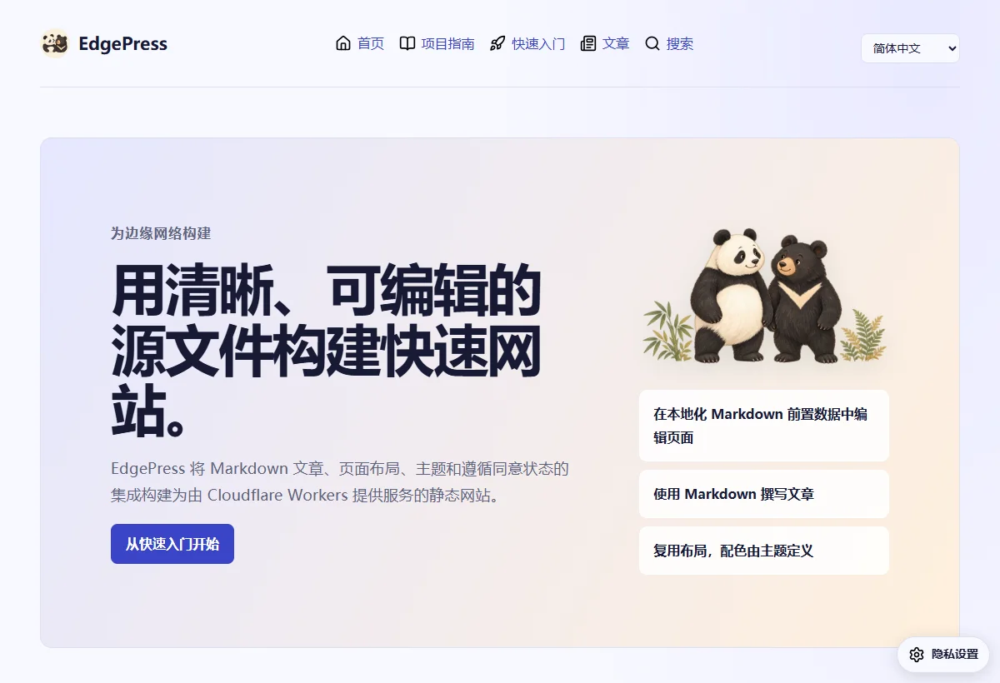

# 边笺

边笺把 Markdown 文章和 YAML 页面布局构建为静态网站。英文界面使用官方名称 EdgePress。首页、文章、搜索、多语言切换和本地 JavaScript 交互都随静态产物发布。



## 本地开始

需要 Node.js 22.12 或更新版本。在新目录中执行：

```sh
npm install edgepress
npx edgepress init
npm install
npm run dev
```

运行 `npm run new -- "我的第一篇文章"`，打开命令输出的文件，在第二个 `---` 后撰写 Markdown。文章放在 `content/posts/<文章目录>/`；页面放在 `content/pages/<页面目录>/`，内容全部写入前置数据的 `blocks`，正文留空。页面先声明栏数，再定义各栏元素。图片放在 `content/assets/`，例如 `content/assets/images/photo.webp` 对应公开地址 `/images/photo.webp`。

发布前在 `config.yml` 填写真实站点 URL、名称、隐私责任人和联系方式；在 `edgepress.config.mjs` 选择主题、路由及语言包。不要编辑生成的 `dist/`。

## 免费额度优先的部署选择

完整数值与官方来源见 [平台比较](platforms.md)，核对日期为 2026-10-04。静态站优先选择 Cloudflare，其次腾讯 EdgeOne Pages；个人非商业网站可选 Vercel，之后是共享积分较少的 Netlify。阿里云 ESA Pages 的静态流量使用站点套餐额度，需先在控制台确认，不能用函数免费请求数代替流量额度。

README 提供五个平台的部署按钮。Cloudflare、Vercel、Netlify 和 EdgeOne 打开仓库模板部署；ESA 按钮打开官方导入页，需要授权 GitHub 并选择仓库。按钮创建新项目，更新已有网站应使用其已连接的仓库。

| 平台 | 仓库内配置 | 部署命令 |
| --- | --- | --- |
| Cloudflare | `wrangler.jsonc` | `npm run deploy:cloudflare` |
| 腾讯 EdgeOne Pages | `edgeone.json` | `npm run deploy:edgeone -- -n my-site` |
| Vercel | `vercel.json` | `npm run deploy:vercel` |
| Netlify | `netlify.toml` | `npm run deploy:netlify` |
| 阿里云 ESA Pages | `esa.jsonc` | `npm run deploy:esa -- --name my-site` |

构建命令统一为 `npm run build`，输出目录统一为 `dist`。平台账号与域名授权仍需由运营者完成。GitHub 手动部署工作流也可选择平台；Netlify 使用仓库 Secret `NETLIFY_AUTH_TOKEN` 和 `NETLIFY_SITE_ID`。

## 可选服务、隐私与缓存

在 `config.yml` 的 `plugins.consent.services` 逐项注册服务，填写服务名、真实 HTTPS 地址、用途、数据类别、接收者、保留期限与隐私链接，覆盖全部启用语言。授权列表直接显示服务名，不使用预设分类或分类标签。访客同意后，服务仍按页面需要或访客操作调用；更换服务地址会使旧授权失效。

评论使用独立的 [我提问](https://github.com/jsw-teams/iask/blob/main/docs/zh-CN.md)，网站只提供通用服务插槽。首页不放评论插槽；需要讨论的页面可增加 `type: service` 和 `integration: github-comments`。文章由构建器生成讨论上下文。服务端密钥只存放在独立服务平台。

接口使用固定 URL 和 HTTP 请求头传递操作与上下文。CSS、JavaScript 及依赖使用内容哈希名称，缓存一年；HTML 和未版本化元数据保持可更新。ESA 需在控制台配置对应缓存规则。布局支持响应式、键盘操作、可见焦点、语义结构和多语言，新增内容仍需填写有意义的图片替代文本。
