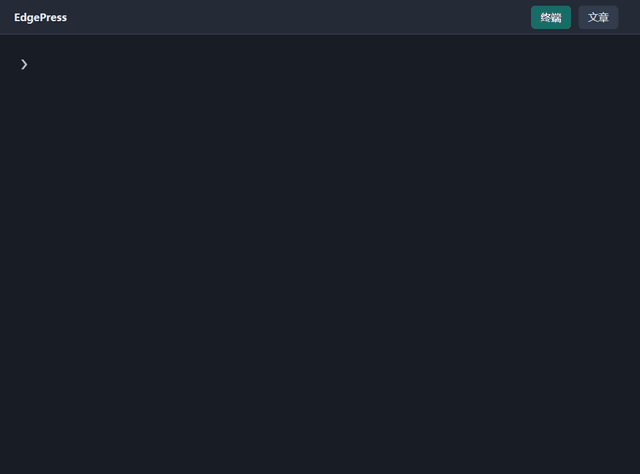

# 写文建站

写文建站把 Markdown 文章和 YAML 页面布局构建为静态网站。英文界面使用官方名称 EdgePress。首页、文章、搜索、多语言切换和本地 JavaScript 交互都随静态产物发布。


构建器自动识别并展示文章最近一次内容调整，无需手写修正说明。界面按“修改前／修改后”“新增／移除”展示具体文字及实际图片，支持 Markdown 排版，窄屏自动纵向排列，颜色跟随主题。封面替换、正文换图及同一路径图片内容被更新均计入变动；改动涉及的本地图片从 Git 恢复成哈希快照，旧文件移除后仍可比较。仅生成最近一次变动需要的图片，按内容去重，缓存一年。设置 `showChanges: false` 可关闭单篇文章的面板。


文章正文可以直接使用接近图片语法的 oEmbed：``。`embed` 会按链接域名匹配服务，`embed:服务 ID` 可以明确指定服务。构建器会先输出固定比例的主题占位符，正文就是唯一来源，不需要在前置数据重复编辑。对应服务须在 `config.yml` 启用；访客保存授权后，内容接近可视区域才加载，未授权时不会请求第三方。文章也可以在前置数据设置 `embeds` 以获得明确尺寸；提示、按钮和外框随页面主题配色。

历史对比需要完整 Git 历史，GitHub Actions 使用 `fetch-depth: 0`。缺少历史时不编造变动；缺少图片历史文件时保留说明，不请求失效地址。不会为重建历史主动访问外部图片地址，也不会发布草稿的图片快照。

## 本地开始

需要 Node.js 22.12 或更新版本。以下命令安装已发布的 npm 版本；最新 GitHub 改动可通过 README 的仓库模板部署，或克隆本仓库后在根目录运行 `npm ci`、`npm run dev`。在新目录中安装 npm 版本：

```sh
npm install edgepress
npx edgepress init
npm install
npm run dev
```

运行 `npm run new -- post "我的第一篇文章"`，打开命令输出的文件，在第二个 `---` 后撰写 Markdown。文章放在 `content/posts/<文章目录>/`；页面放在 `content/pages/<页面目录>/`，内容全部写入前置数据的 `blocks`，正文留空。页面先声明栏数，再定义各栏元素。图片放在 `content/assets/`，例如 `content/assets/images/photo.webp` 对应公开地址 `/images/photo.webp`。

发布前在 `config.yml` 填写真实站点 URL、名称、隐私责任人和联系方式；在 `edgepress.config.mjs` 选择主题、路由及语言包。不要编辑生成的 `dist/`。

## 免费额度优先的部署选择

完整数值与官方来源见 [平台比较](platforms.md)，核对日期为 2026-10-04。静态站优先选择 Cloudflare，其次腾讯 EdgeOne Pages；个人非商业网站可选 Vercel，之后是共享积分较少的 Netlify。阿里云 ESA Pages 的静态流量使用站点套餐额度，需先在控制台确认，不能用函数免费请求数代替流量额度。

README 提供五个平台的部署按钮。Cloudflare、Vercel、Netlify 和 EdgeOne 打开仓库模板部署；ESA 按钮打开官方导入页，需要授权 GitHub 并选择仓库。按钮创建新项目，更新已有网站应使用其已连接的仓库。

| 平台 | 仓库内配置 | 部署命令 |
| --- | --- | --- |
| Cloudflare | `wrangler.jsonc` | `npm run deploy:cloudflare` |
| 腾讯 EdgeOne Pages | `edgeone.json` | `npm run deploy:edgeone -- -n my-site` |
| Vercel | `vercel.json` | `npm run deploy:vercel` |
| Netlify | `netlify.toml` | `npm run deploy:netlify` |
| 阿里云 ESA Pages | `esa.jsonc` | `npm run deploy:esa -- --name my-site` |

构建命令统一为 `npm run build`，输出目录统一为 `dist`。平台账号与域名授权仍需由运营者完成。GitHub 手动部署工作流也可选择平台；Netlify 使用仓库 Secret `NETLIFY_AUTH_TOKEN` 和 `NETLIFY_SITE_ID`。

## 可选服务、隐私与缓存

在 `config.yml` 的 `plugins.consent.services` 逐项注册服务，填写服务名、真实 HTTPS 地址、用途、数据类别、接收者、保留期限与隐私链接，覆盖全部启用语言。授权列表直接显示服务名，不使用预设分类或分类标签。访客同意后，服务仍按页面需要或访客操作调用；更换服务地址会使旧授权失效。

评论使用独立的 [我提问](https://github.com/jsw-teams/iask/blob/main/docs/zh-CN.md)，网站只提供通用服务插槽。首页不放评论插槽；需要讨论的页面可增加 `type: service` 和 `integration: github-comments`。文章由构建器生成讨论上下文。服务端密钥只存放在独立服务平台。

接口使用固定 URL 和 HTTP 请求头传递操作与上下文。CSS、JavaScript 及依赖使用内容哈希名称，缓存一年；HTML 和未版本化元数据保持可更新。ESA 需在控制台配置对应缓存规则。布局支持响应式、键盘操作、可见焦点、语义结构和多语言，新增内容仍需填写有意义的图片替代文本。

## 看看生成的网站



示例展示由写文建站生成的实际页面。可用静态封面搭配按需加载 GIF，提供观看、暂停和重播，见[演示配置](product-demos.md)。

## 项目演示与图标

演示通过 `edgepress new post '你好世界'` 新建文章，在代码编辑器修改后运行 `edgepress server`，从首页点击进入文章。录制工作台位于 `tools/demo-workbench.mjs`，临时录制内容放在忽略的 `tools/.recordings/`。网站演示由访客手动播放，支持拖动进度和键盘操作，保留暂停位置。导航与页面图标使用本地打包的 Lucide 1.52，并保留许可证。
